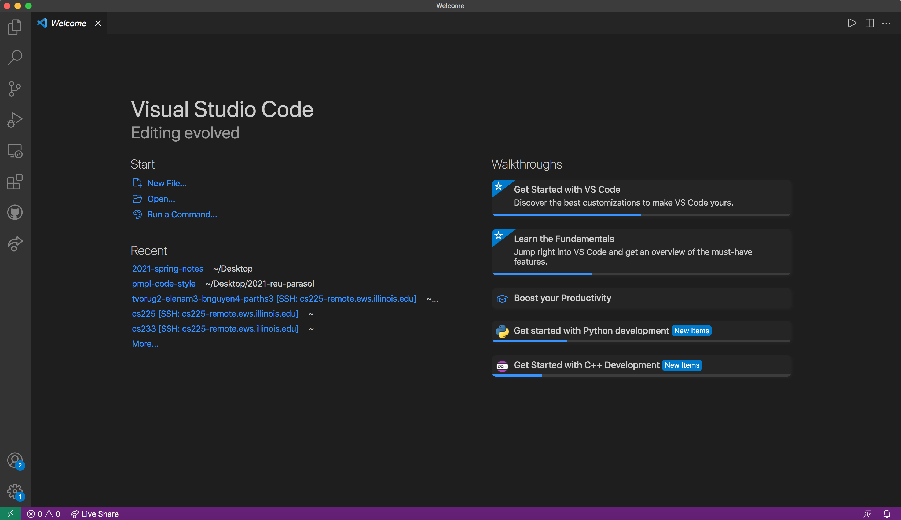
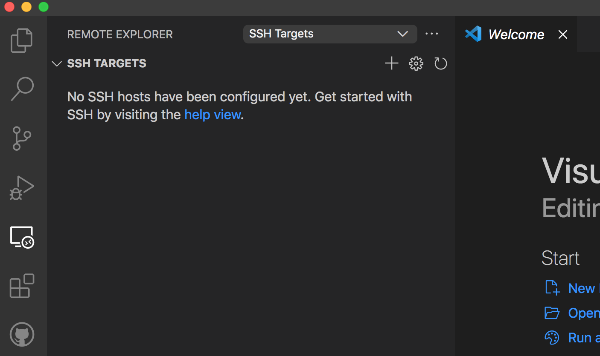
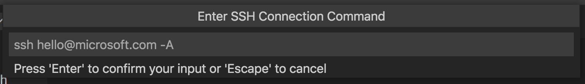
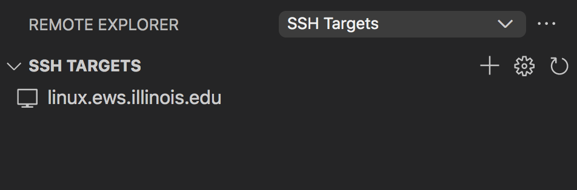
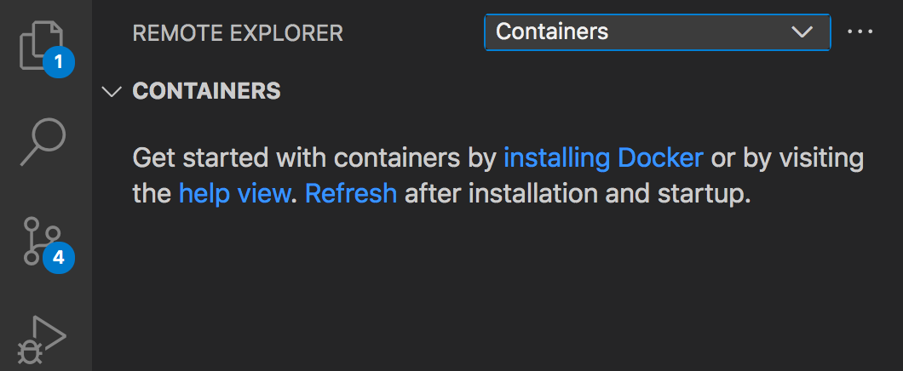

# CS225 | On your own machine

In this guide, we will go over how to properly set up your machine so that you can run CS 225 code in the least hassle possible! 

#
- [CS225 | On your own machine](#cs225--on-your-own-machine)
  - [Introduction](#introduction)
    - [Pros/Cons](#proscons)
    - [Before getting started](#before-getting-started)
  - [1) SSH through VSCode](#1-ssh-through-vscode)
    - [Instructions](#instructions)
  - [2) Docker](#2-docker)
    - [Instructions](#instructions-1)
  - [3) Fast X](#3-fast-x)
    - [Instructions (web browser)](#instructions-web-browser)
    - [Instructions (desktop client)](#instructions-desktop-client)
  - [Troubleshooting](#troubleshooting)

#
## Introduction
Connecting and testing your code on the Engineering Works Space (EWS) environment is vital to your success in CS 225. You want to develop on as close to a platform as our testing platform to make sure everything runs correctly. If you do not test on EWS, you might be using the wrong C++ version or extra packages that are not allowed during testing, causing your test cases to fail. In order to set yourself up for success, we have created a guide to help either emulate or connect to the same environment we test on.

There are 3 main ways of doing so: 
1) [SSH through VSCode](#ssh-through-vscode)
2) [Docker](#docker)
3) [Fast X](#fastx)

### Pros/Cons
|          | Pros                 | Cons | Time |
| :------- | :------------------- | :------------------ | :--- |
| VSCode SSH  | Fast, less resource intensive| Req. Internet connection | 5 min.|
| Docker      | No internet, on local disk   | Resource intensive | 5 min. |
| Fast X      | Graphical UI*   | Fast internet | 1 min. |

****Note**: VSCode can display files like images, text, etc. as well. FastX is only 
good if you need to display any simulation things like GTKWave (which is not used in this course)*

Each of the above are ranked by ease to use and install.


### Before getting started
- Make sure you have an internet connection
- The Terminal is a way to interact with your computer using text rather than with a graphical interface, and we use it a lot to run programs. Familiarize yourself with the terminal for your operating system (ie. `ls`, `cd`, `mkdir`, `git`, etc.). Feel free to keep a terminal cheat sheet on hand. Note that windows command line uses `dir` in place of `ls`. Start by Google searching "terminal" followed by the name of your operating system.
- (Optional) Familiarize yourself with `git` and the most popular commands `git add`, `git commit`, `git checkout`, `git branch`, `git status`, and more. I suggest [this tutorial](https://learngitbranching.js.org/) for those who are new to Git.

#
<a name="ssh-through-vscode"></a>
## 1) SSH through VSCode

We will use Secure Shell (SSH) to help us access an EWS node through Visual Studio Code (VSCode). SSH is a way of connecting to another computer without needing to be there in person. VSCode is a text editor that allows us to also use SSH functionality so we can edit code that is hosted on EWS. At UIUC, you can request compute resources through EWS with your NetID and use it to work on assignments from your classes. The reason we want to use an EWS server is because CS 225 runs test on EWS so you want to test your code with the tools you can and can't use. Let's get started.

### Instructions
1. <a name="vscode"></a> **Download VSCode**: Download VSCode from [this](https://code.visualstudio.com/download) link. Make sure to get the correct version for your operating system. Follow the instructions to install the application.
https://code.visualstudio.com/download

    ***Note**: If you are confused whether to get the 64-bit or 32-bit version, you can check your computer's OS for the information. Most computers will use the 64-bit version.*


2. **Remote-SSH Extension**: Once VSCode is installed, open the application up. You should see something like this:

    

    On the left sidebar, click the icon with the 4 cubes (). This should open the Add-On Extensions page. Search for the "Remote-SSH" extension.

3. **Connect to EWS**: To SSH$^{1}$ into EWS, press the computer monitor icon that has appeared on your sidebar (). 

    $^1$**Note**: SSH is also used as a verb, meaning *to connect to a server using SSH*.

    The phrase `SSH Targets` should be displayed near the top. If this is not the case, click on the drop down menu located at the top of this window, and select `SSH Targets`. It should look like this:

    

    Mouse over `SSH Targets` and press the `+` button that pops up. 

    VSCode will then prompt you for the SSH target. 
    
    
    
    Type in the following, replacing `[NETID]` with your NetID.

    
    ```
    [NETID]@linux.ews.illinois.edu
    ```

    Press `Enter` to confirm your input or `Escape` to cancel if you typed it incorrectly.

    VSCode will then prompt again in which file you would like to save the target. Pick the one underneath the `/Users/` directory:

    ```
    /Users/[YOUR USERNAME]/.ssh/config
    ```

    If everything worked, you will see a new SSH target pop up on the left window called `linux.ews.illinois.edu`. Here is another picture to verify with:

    

4. **Open a new VSCode window**: Mouse over the `linux.ews.illinois.edu` target. You should see a small button pop up on the right (). Click on it.

    A new VSCode window should pop up and automatically attempt to connect to the remote EWS server through SSH. Wait a moment for it to load. It will then prompt you to enter a passcode. 
    
    Enter your Illinois passcode associated with your NetID. It will load up the window and connect to your SSH. If it is not working, make sure you have correctly typed your passcode and correctly spelled the SSH target (see 3).

5. **Git in CS225**: Follow [this](https://courses.grainger.illinois.edu/cs225/fa2021/resources/) link to set up GitHub on EWS.

Now you should be fully connected to EWS through SSH on VSCode and can use VSCode as if it were on your own computer. The only thing that will be different is that you are accessing the files of the target computer rather than your local computer.
#
<a name="docker"></a>
## 2) Docker
**WARNING! Docker may not work on M1 Macs.**

From [Wikipedia](https://en.wikipedia.org/wiki/Docker_(software)):
> Docker is a set of platform as a service products that use OS-level virtualization to deliver software in packages called containers.

Basically, we are able to emulate a Linux environment (specifically the EWS one) and run code on there to test. The power of doing so is that we don't need to connect to anything else as everything runs locally on your computer. Let's get into it!

### Instructions

1. **Installing Docker:** Use [this](https://docs.docker.com/get-docker/) link and follow the directions listed to install Docker. Make sure you install the one for your OS.

    Once you have installed the application, start up Docker Desktop, as you may need to setup some settings.


2. **Install VSCode**: Install VSCode following [these](#vscode) instructions from the [VSCode install](#vscode).

    Once installed, on the left toolbar click on the "*Add-On Extensions*" button (). Search for "Remote-Containers" (by Microsoft) and click install.
    
3. <a name="docker-3"></a>**Git in CS 225**: Use the following [link](https://courses.grainger.illinois.edu/cs225/fa2021/resources/) to set up Git for the class. Finish that tutorial before coming back to this one.

    Navigate to the `cs225git/` folder that you have created (the git repository).

    Make a new blank file named `Dockerfile` inside this folder. If it asks for a file extension, choose to omit it. 

    In the file, copy and paste the following text inside:

    ```
    FROM james9909/cs225-autograder:latest
    RUN yum install -y gdb
    ENTRYPOINT bash
    ```

4. **Create the "Remote" Container**: Navigate to the "*Remote Explorer*" denoted by this file icon - . 

    At the top, there should be a drop bar (or just a bar if you have not downloaded the "Remote-SSH" extension) and choose "Containers." The first thing on the left window will show "Containers" and a short blurb about how to get started.

    

    At the bottom-most righthand corner of your screen, there is a green widget button () with two arrows facing each other. Click it and a prompt should pop up. Search for the command `Remote-Container: Open Folder in Container`.

    It will then prompt you which folder you want to open, choose `cs225git/` (full path: `/home/[YOUR NETID]]/cs225git/`). It will then prompt you again and choose the `From Dockerfile` option. 

    ***Note**: If you don't find the `From  Dockerfile` option, check out [this](#trouble4) troubleshooting question.*

    Loading the docker container will take some time for the first time. This is expected.

If it works, you can access your local files using VSCode and run them using the terminal inside your Docker container. Visit the troubleshooting section if you have any questions!

#
<a name="fastx"></a> 
## 3) Fast X

Fast X is a method of connecting to a remote server and streaming the UI/UX that users are accustomed to instead of just the file system. The advantage of this is sometimes there are applications that you cannot display locally (ie. simulations), that you need to actually stream directly from the server itself. The only problem is that this usually requires a strong and fast internet connection.

Instructions mainly taken from [here](https://answers.uillinois.edu/illinois.engineering/page.php?id=81727).
### Instructions (web browser)
1. **Website Link**: Copy and paste (or click) this link in your web browser https://fastx.ews.illinois.edu
   
   When prompted, enter your NetID and Illinois password.


2. **Launch Session**: Press "Launch Session" and select "MATE" as the option.
3. **Start VSCode**: Startup VSCode in FastX and click the "File Explorer" button on the left sidebar (1st button) and press the "Open Folder" blue button. Choose your home directory (the path is `/home/[YOUR NETID])
4. **Git in CS225**: Follow [this](https://courses.grainger.illinois.edu/cs225/fa2021/resources/) link to set up GitHub on EWS.

### Instructions (desktop client)
1. **Download FastX**: Download the FastX Client here: https://www.starnet.com/fastx/current-client.

    Once it has finished downloading, start FastX.

2. **Establish new connection**: Click the `+` sign to add a new connection, and select "SSH"

    Enter the following information in the window that pops up.

    ```
    Name: EWS Linux
    Host: fastx.ews.illinois.edu
    Port: 22
    User: [YOUR NETID]
    ```
    
    Make sure you replace `[YOUR NETID]` with your actual NetID. Do not check the "FIPS compliant mode" box.

    Click save.

3. **Setup Connection**: Double-click the connection. Enter your Illinois password when prompted. 

    Click the `+` icon to launch a new graphical session. Double click `MATE` to launch the session using Mate.

4. **Start VSCode**: Startup VSCode and click the "File Explorer" button on the left sidebar () and press the "Open Folder" blue button. Choose your home directory (the path is `/home/[YOUR NETID]`)


5. **Git in CS225**: Follow [this](https://courses.grainger.illinois.edu/cs225/fa2021/resources/) link to set up GitHub on EWS.

***Note**: Make sure to log out of your session after you are done. If you don't, it will take 10 minutes until your session will be terminated. If you accidentally disconnect, you will be able to continue from where you left off if you log in within 10 minutes of disconnection.*

#
## Troubleshooting
- Why do I get a rejected connection when I connect to EWS with SSH?
  - Check that you have correctly spelled the SSH target (`[NETID]@linux.ews.illinois.edu`). Also make sure you are correctly entering in your Illinois password.
- I cannot find `cs225git/`
  - If you have followed the guide to setting up CS 225 but you cannot find the `cs225git/` folder in your `/home/[NETID]` directory, it could be that you cloned the repository with just your NetID, so look for a folder with your NetID here (ie. `[NETID]/`). If you do not see either `/home/[NETID]/cs225git/` or `/home/[NETID]/[NETID]`, make sure you have ran this command in the terminal (inside your `/home/[NETID]` folder): 
  
    ```
    git clone https://github-dev.cs.illinois.edu/cs225-fa21/NETID.git cs225git
    ```

    Note: Make sure to replace `NETID` with your actual NetID in the URL.
- <a name="trouble4"></a>There is no option to choose a Dockerfile when I try to create a new container
  - Make sure you have done [step 3 of the Docker install](#docker-3).
- My FastX is being rejected
  - Most likely it is because it doesn't like your IP or you do not have port forward enabled. Try connecting to campus VPN using this link: https://go.illinois.edu/vpn
- None of my Git commands are working!
  - You may need to install Git (especially if you are on Windows). Follow [this website](https://git-scm.com/book/en/v2/Getting-Started-Installing-Git) for information on how to do it.